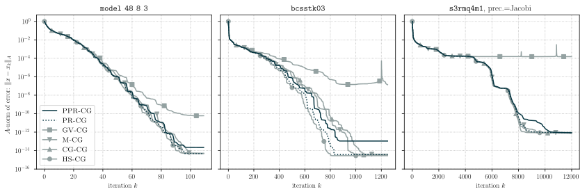

# New communication hiding conjugate gradient variants

This folder contains materials to help reproduce the results of:

    @article{chen_19,
        Author = {Tyler Chen},
        Title = {New communication hiding conjugate gradient variants},
        Howpublished = {In progress},
        Year = {2019}
    }

An extended introduction to this paper can be found [here](https://chen.pw/research/publications/predict_and_recompute.html).

## Instructions
All figures and table data from the paper can be generated by navigating to the `experiments` folder, and running `figure_gen.py`.

Generating plots for different matrices is easy. 
Simply add the desired `.mtx` files to the `matrices` folder, and add update the `matrices` list in `figure_gen.py` accordingly. 

To generate plots of different quantities, define the appropriate callback function and add it to the `test_matrix` function.
Then add a plot of this quantity in the `plot_matrix_test` function.

## Notes
You will need Python 3.6 or higher, since I use f-strings.
If you do not have access to Python 3.6, you can replace all f-strings with other string formats and everything should work (if you have a reasonably recent versions of numpy and scipy).

While lots of the experiments run almost instantly on a laptop, there are other experiments which require much longer (hours or days depending on your hardware).
The code is fairly modular, so you can test a single variant on a single matrix, and then regenerate the corresponding figure.
This makes it easier to verify the convergence of a single variant on big problems, since you don't have to run all of the variants.

Github has a filesize limit of 100mb.
As such, I was not able to upload the matrix `s3dkq4m2`. It can be downloaded from the matrix market](https://math.nist.gov/MatrixMarket/data/misc/cylshell/s3dkq4m2.html).

Finally, while I have done my best to run a range of representative experiments, it is quite possible that there are problems on which the variants from this paper do not work better than previously known communication hiding variants. 
If you are able to find any such problems please let me know so that I can include them in the preprint.

## Repository contents

This folder is roughly structured as follows:

- `numerical_experiments` : python scripts for generating numerical experiments
    - `data` : raw convergence data and table summary statisitcs
    - `figures` : convergence plots for all numerical experiments, and compiled table summary statistics
- `scaling_experiments` : scripts to run scaling tests and plot results
- `cg_variants` : implementations of various conjugate gradient variants
- `callbacks` : some available callback functions to use with implemented variants to gather convergence data
- `matrices` : test matrices
